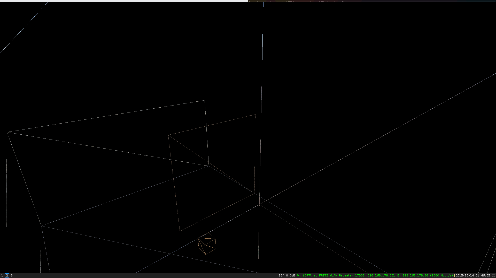

# OpenGL-3D-Engine

## Features:

-Mesh and scene management

-Skybox

-First person controller

-Animations

-Keyboard event callbacks

## Dependencies:

libsoil-dev
libglm-dev
libglfw3-dev
libglew-dev

## Screenshots:

The actual engine's code is located at "https://github.com/sugeedarou/OpenGL-3D-Engine/tree/master/code/LS3D"

Refer to https://github.com/sugeedarou/OpenGL-3D-Engine/blob/master/code/main.cpp for an example usage.

Refer to https://github.com/sugeedarou/OpenGL-3D-Engine/tree/master/code/engine for an example voxel engine using the 3D Engine.

Textures are not included for copyright reasons.

Some parts of the code are inspired by this great OpenGL Tutorial: https://learnopengl.com/
