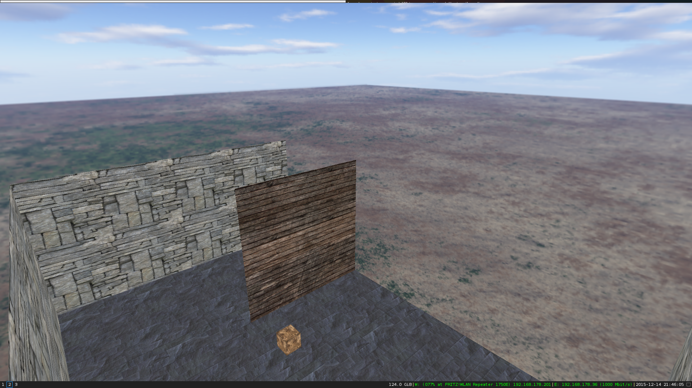

# OpenGL-3D-Engine
### A 3D engine written in C++ using OpenGL

## 🗺️ Navigation 
- [<code>🖼️ Screenshots</code>](#-screenshots)
- [<code>📋 Features</code>](#-features)
- [<code>🗄 Dependencies</code>](#-dependencies)
- [<code>📦 Getting started</code>](#-getting-started)
- [<code>📝 License</code>](#-license)
- [<code>❤️ Credits</code>](#-credits)

## 🖼️ Screenshots

  

  
## 📋 Features
- GameObject and scene management
- Transformations
- Skybox
- First person controller
- Keyboard event callbacks

## 🗄 Dependencies
libsoil-dev, libglm-dev, libglfw3-dev, libglew-dev

## 📦 Getting started
The engines code can be found [here](https://github.com/lischilpp/opengl-3d-engine/tree/master/code/LS3D)

This is an [example main.cpp](https://github.com/lischilpp/opengl-3d-engine/tree/master/code/engine) for using the engine.

[Here](https://github.com/lischilpp/opengl-3d-engine/tree/master/code/engine) you can find an example voxel engine using the 3D Engine.

## 📝 License
This project is licensed under the GPL-3.0 License - see the [LICENSE](LICENSE) file for details

## ❤️ Credits
Some parts of the code are inspired by this great OpenGL Tutorial: https://learnopengl.com/
